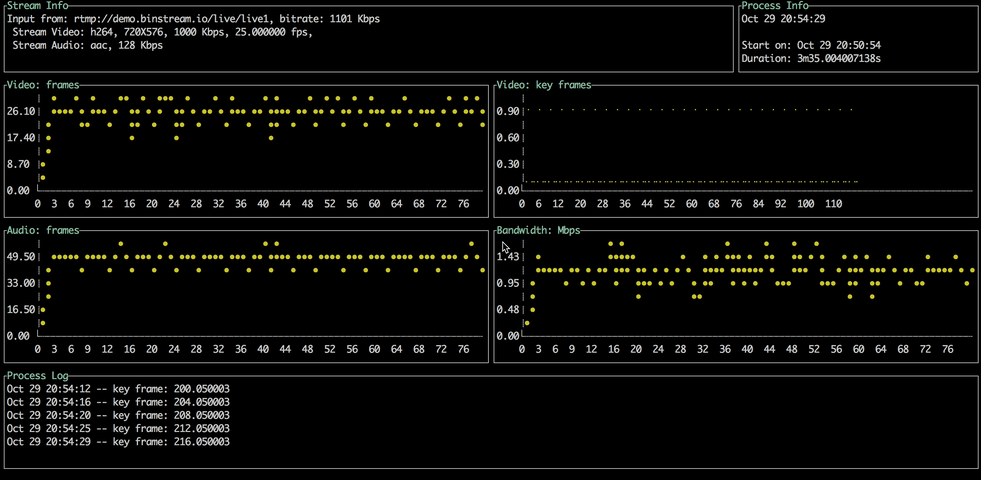
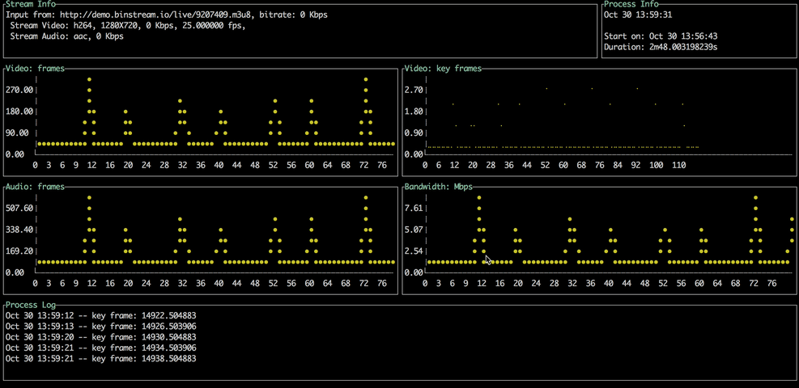

# lsa
## Introduction
lsa is simple **Live Stream Analyzer** running in console.

lsa is based on FFmpeg, gmf, and termui

## Usage
``` bash
./lsa live_stream_url
```

Output example(RTMP):


Output example(HLS):



## How to build
Add ffmpeg library path to pkgconfig pth:
``` bash
export PKG_CONFIG_PATH=$PKG_CONFIG_PATH:/usr/local/ffmpeg/lib/pkgconfig/
```

Ensure, that PKG_CONFIG_PATH contains path to ffmpeg's pkgconfig folder.
``` bash
pkg-config --libs libavformat
```

It should print valid path to the avformat library.

Now, just run
``` bash
go get github.com/binstreamio/lsa
```

## Links
1. https://github.com/FFmpeg/FFmpeg -- FFmpeg is a collection of libraries and tools to process multimedia
2. https://github.com/3d0c/gmf -- Go Media Framework
3. https://github.com/gizak/termui -- a cross-platform, easy-to-compile, and fully-customizable terminal dashboard

